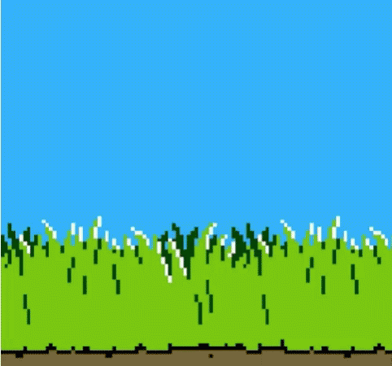

# 🦆 Retro Duck Hunt (Web Edition)

A nostalgic pet project created during the long COVID-19 lockdown. When being stuck at home became a bit too much, I decided to fight the boredom by recreating one of my favorite 8-bit childhood games (the classic from the Dendy/NES era) using web technologies.
I even recorded a voice-over myself (quarantine was seriously driving me crazy back then) 🤪.

No cartridges or light guns required - just your browser, some nostalgia, and ducks.

Did this game bring a nostalgic smile to your face?
Consider giving the repository a ⭐ — your support really means a lot!

  

*inspired by <a href="https://www.albertopasca.it/whiletrue/nintendo-duck-hunt-clone/">this article</a>

## 🎮 Play Now In Your Browser
The game is fully playable in modern browser. 
 
 
Stop looking at the code — it's time to play! 
Let's see: is your aim better now than in your school days?

  

## 🛠 Tech Stack

Built entirely on the frontend using:
* **Pure JS** — for the core game logic and mechanics.
* **HTML5 & CSS3** — for the structure, layout, and retro styling.
* No heavy frameworks, just vanilla web technologies!

## 🚀 How to Run Locally

If you want to run the code on your own machine:
1. Clone the repository
2. Run index.html file
